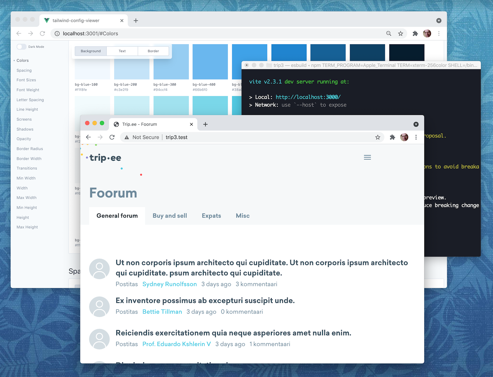

## About

https://trip.ee stack exploration. See more at https://github.com/tripikad/trip2/issues/1970

## Getting started

### Installation

First, run

```sh
composer install
npm i
```

Then connect to a database in `.env` file

```sh
# .env

DATABASE_URL=mysql://...
```

If you use local database, run also the migrations

```sh
php artisan migrate --seed
```

### Development

First, run PHP server: either use [Valet](https://laravel.com/docs/8.x/valet) or Octane:

```sh
php artisan octane:start
```

Then run Vite server

```sh
npm run dev
```

### Production

Run

```sh
npm run build
```

Then set the environment:

```sh
# .env

APP_ENV=production
```

## Vue components

### Component types

We support both eager-loaded and lazy-loaded (async) components:

#### Eager-loaded

```
/resources/js/components/*.vue
```

Eager loaded are bundled to the main app bundle and immediately loaded. Use eager-loaded components for simple components that do not have (huge) third-party dependencies.

#### Lazy-loaded (async) compoennts

```
/resources/js/components_async/*.vue
```

Lazy loaded components are loaded only when needed on a page. They are useful for bigger, complex components that use third-party libraries (text editors etc).

Note that async components are loaded later and cause layout shifts.

### Component syntax

For the component syntax we use Vue 3 [composition API](https://v3.vuejs.org/guide/composition-api-introduction.html), the new [script setup](https://github.com/vuejs/rfcs/blob/script-setup-2/active-rfcs/0000-script-setup.md) component syntax and Typescript (experimental).

> Typescript is there for IDE ergonomics only and this decision can easilty rolled back.

#### Vue 2 component

```vue
<script>
export default {
    props: {
        title: { type: String },
    },
    data() {
        return { counter: 0 };
    },
    methods: {
        increase() {
            this.counter++;
        },
    },
    computed: {
        hugeCounter() {
            return this.counter * 1000;
        },
    },
};
</script>
```

#### Vue 3 component

```vue
<script setup lang="ts">
import { defineProps, ref, computed } from "vue";

defineProps<{ title: string }>();

const counter = ref(0);
const increase = () => counter.value++;
const hugeCounter = computed(() => counter.value * 1000);
</script>
```

### Vue component helpers

There are several component helpers available:

`route()`: for using Laravel named routes

`trans()` and `__()` for translations

For templates the helpers globally available, for script you will need to import them first.

```vue
<script setup lang="ts">
import { route } from "../utils";

route("frontpage"); // ...
</script>
```

### Generate model types

(experimental) To generate the Typescript types based on Eloquent models, run

```sh
php artisan generate:types
```

It will write the model types to `/resources/js/types` with some additional typing information.

Here is the auto-generated `Comment` type:

```ts
export type Comment = {
    id: number;
    user_id: number;
    content_id: number;
    body: string | null;
    created_at: string /* Date */ | null;
    updated_at: string /* Date */ | null;
    content?: Content | null;
    user?: User | null;
};
```

To use the types, import them in the component and use them in the props declaration:

```vue
<script setup lang="ts">
import { defineProps } from "vue";
import type { Comment } from "../types";

defineProps<{ comment: Comment }>();
</script>
```

## Tailwind CSS (experimental)

This demo use Tailwind for CSS handling with custom configration that brings in Trip.ee custom colors and typography.

> Tailwind decision has not yet been made, this exploration tests out the ergonomics of the utility classes workflow.

## Testing

### Running tests

#### Running tests in development

The test are Laravel Dusk tests, running usin Puppeteer.

1. Make sure you have `APP_URL` set in `.env`

```sh
# .env

APP_URL=http://trip3.test
```

2. Run dev server

```sh
npm run dev
```

3. Run the tests in a separate tab

```sh
php artisan dusk
```

#### Running tests in CI

https://laravel.com/docs/dusk#running-tests-on-github-actions

### Writing tests

#### Selecting items in Vue components

For selecting items on Vue componentents it is recommended to use [Dusk selectors](https://laravel.com/docs/dusk#dusk-selectors) and wait the selectors to be appear on the page.

```html
<h1 dusk="nav">Trip.ee</h1>
```

```php
$browser->visit("/")->waitForTextIn("@nav", "Trip.ee");
```

See also:

https://protone.media/en/blog/a-package-for-laravel-dusk-to-wait-for-inertiajs-events?ref=laravelnews

## Recommended tooling

### VS Code

See [/.vscode/extensions.json](/.vscode/extensions.json)

### PHPStorm

**Tailwind Formatter** https://plugins.jetbrains.com/plugin/13376-tailwind-formatter/

See also https://youtrack.jetbrains.com/issue/WEB-49000
